# Application Architecture

Shows thoughtsapp's two packaging modes built from one codebase: the full microservices build (as
it lives in the repo today) and the monolith build for HTTP-only targets that can't run Kafka.

```mermaid
flowchart TB
    subgraph Microservices["Microservices mode (as in the repo)"]
        direction LR
        FE1["thoughts-frontend\n(Next.js)"]
        FE2["thoughts-admin-ui\n(Vite/React)"]
        BE1["thoughts-backend\n(Quarkus REST)"]
        DB1[("PostgreSQL + pgvector")]
        Kafka{{"Kafka: thoughts.events"}}
        Eval1["thoughts-evaluation\n(Quarkus + Langchain4j)"]
        LLM1[["LLM embedding endpoint"]]
        Info1["/info endpoint"]
        Badge1["UI badge:\n\"Served from: AKS\""]

        FE1 --> BE1
        FE2 --> BE1
        BE1 --> DB1
        BE1 --> Kafka
        Kafka --> Eval1
        Eval1 --> DB1
        Eval1 --> LLM1
        BE1 --> Info1
        Info1 -. DEPLOYMENT_TARGET .-> Badge1
    end

    subgraph Monolith["Monolith mode (HTTP-only targets)"]
        direction LR
        Mono["Single Quarkus container\n(serves static frontends from\nMETA-INF/resources)"]
        DB2[("PostgreSQL + pgvector")]
        Eval2["Evaluation logic\n(in-process via CDI event)"]
        Info2["/info endpoint"]
        Badge2["UI badge:\n\"Served from: ACI\""]

        Mono --> DB2
        Mono -- CDI event --> Eval2
        Eval2 --> DB2
        Mono --> Info2
        Info2 -. DEPLOYMENT_TARGET .-> Badge2
    end
```

In both modes, frontends fetch `DEPLOYMENT_TARGET` from the backend at runtime — it is never baked
in at build time via `NEXT_PUBLIC_*` (Next.js) or `VITE_*` (Vite) environment variables.
