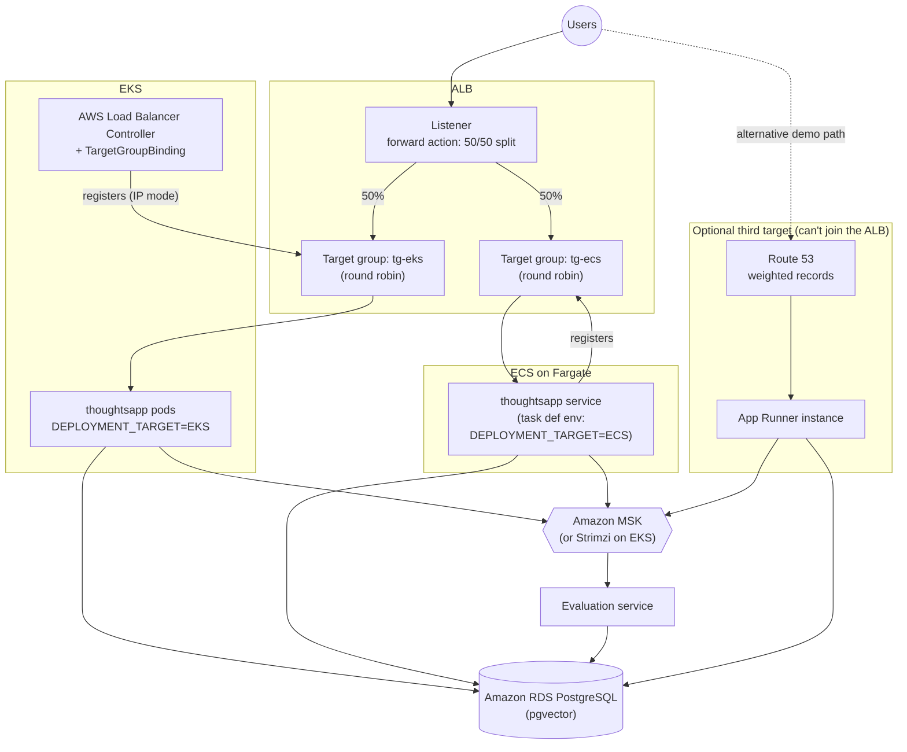

# AWS Deployment

AWS-specific deployment diagram: thoughtsapp running on both EKS and ECS on Fargate, behind one
ALB, sharing one RDS PostgreSQL database and one Kafka + evaluation service.

App Runner cannot register with an ALB target group, so it isn't part of the 50/50 ALB split —
it's shown here as an optional separate path fronted by Route 53 weighted DNS records, or it can
simply be kept as its own standalone demo URL.
