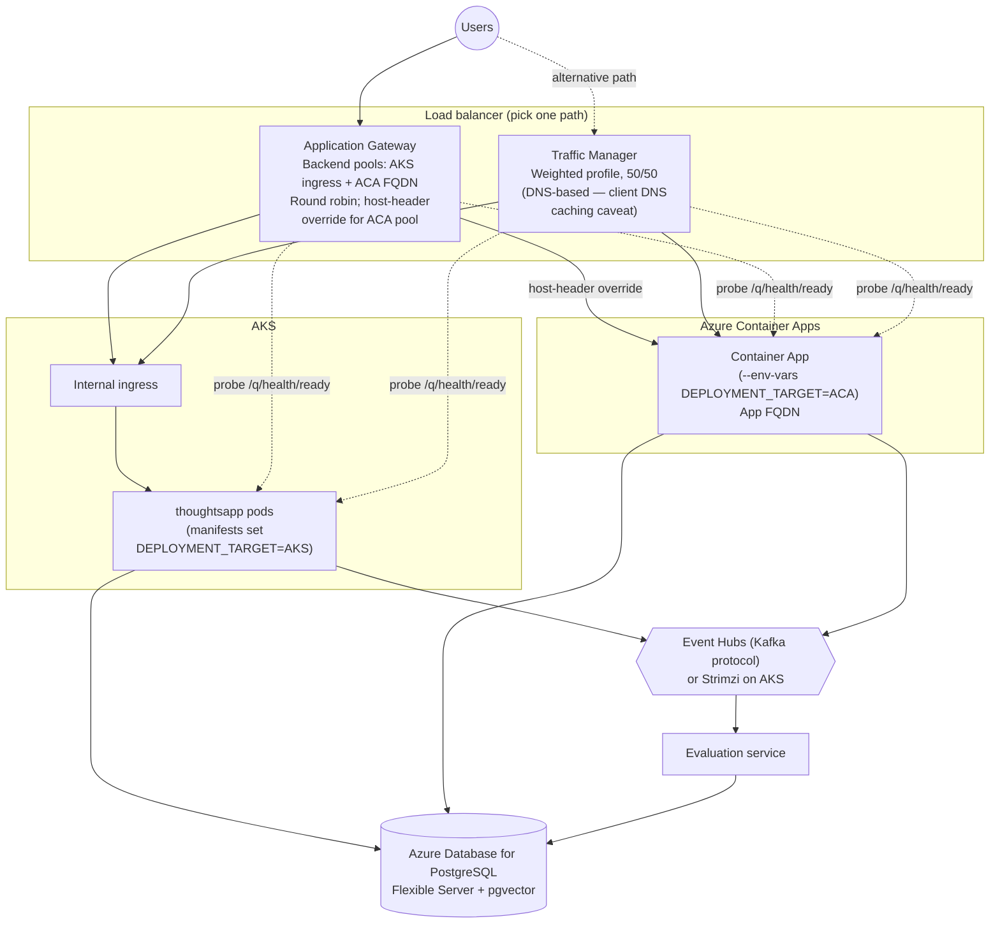

# Azure Deployment

Azure-specific deployment diagram: thoughtsapp running on both AKS and Azure Container Apps,
fronted by one of two alternative load-balancing paths, sharing one PostgreSQL database and one
Kafka + evaluation service.

The Application Gateway and Traffic Manager paths are alternatives, not run simultaneously — pick
one per deployment. Traffic Manager's 50/50 weighted routing is DNS-based, so clients may keep hitting the
same target until their resolver's cached record expires, unlike Application Gateway's per-request load
balancing.
