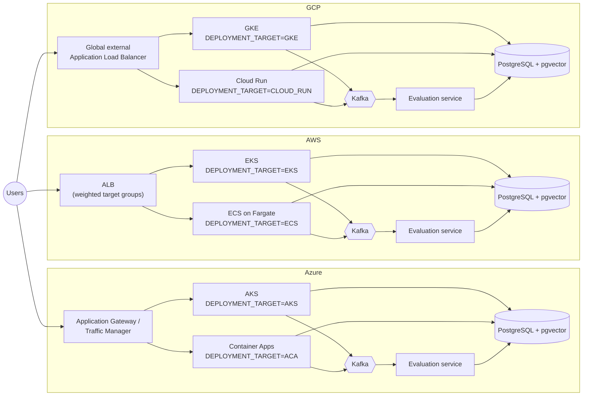

# Cross-Cloud Overview

Top-level architecture diagram showing the entire demo at a glance: the same thoughtsapp image set
deployed to multiple container targets in Azure, AWS, and GCP, each cloud fronted by its own load
balancer, each cloud with exactly one shared PostgreSQL database and one Kafka + evaluation service.

