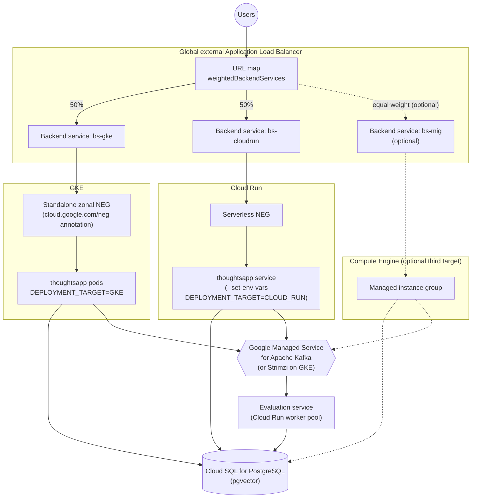

# GCP Deployment

GCP-specific deployment diagram: thoughtsapp running on both GKE and Cloud Run, behind a global
external Application Load Balancer, sharing one Cloud SQL database and one Kafka + evaluation
service.

The Compute Engine MIG backend is an optional third target at equal weight, not part of the
required 50/50 GKE/Cloud Run split — shown with dashed edges. Unlike the microservices evaluation
service on GKE, the Cloud Run evaluation deployment runs as a **worker pool**, not a
request-serving service, since it only needs to consume Kafka events.
