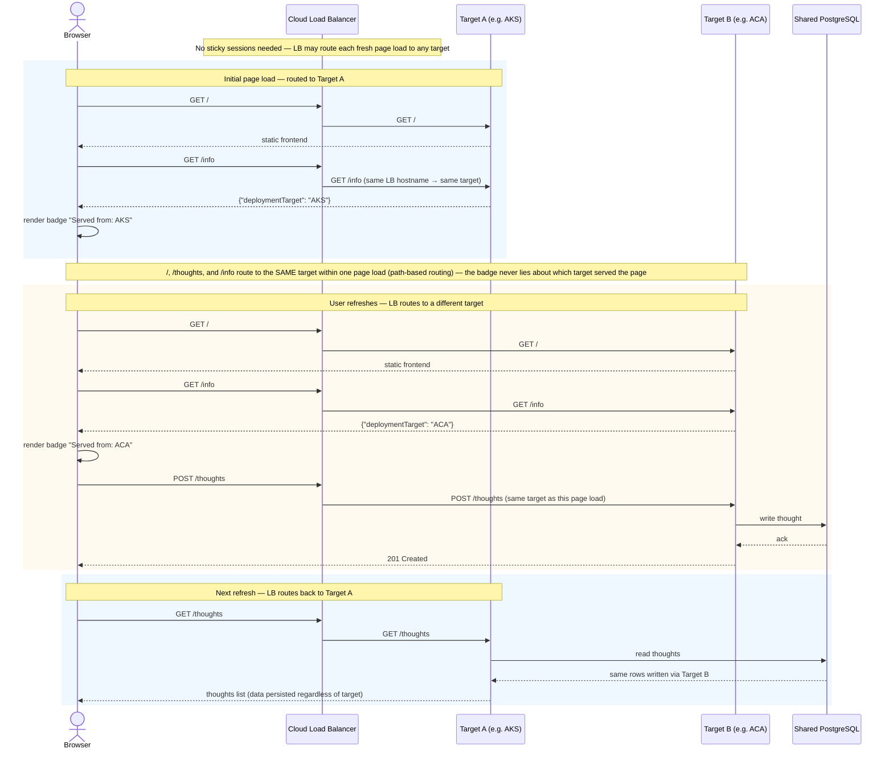

# Round-Robin Request Flow

Sequence diagram of a user's browser cycling between deployment targets on refresh, and the UI
displaying which platform actually served each page load.

Because both targets read and write the same shared PostgreSQL, and neither the load balancer nor
the app tier keeps any per-user state, no sticky sessions are required — the load balancer is free
to route every fresh page load to whichever target it likes.
